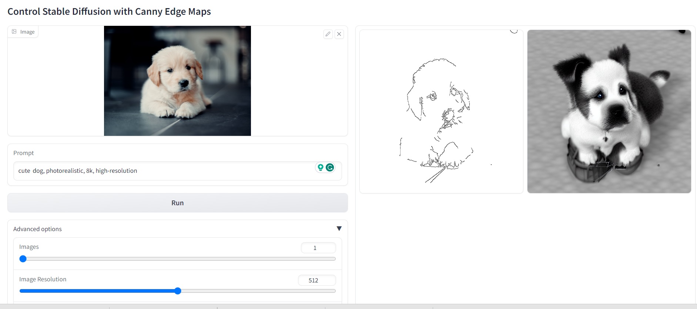
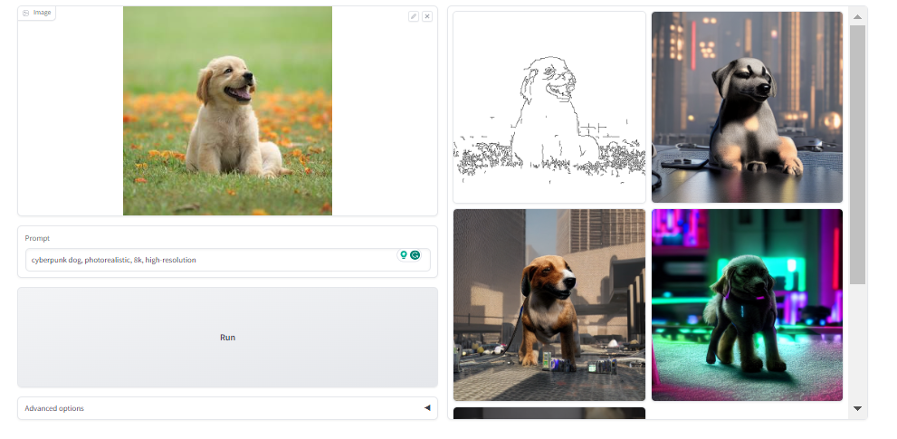
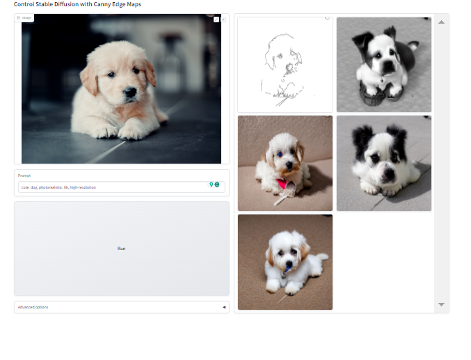
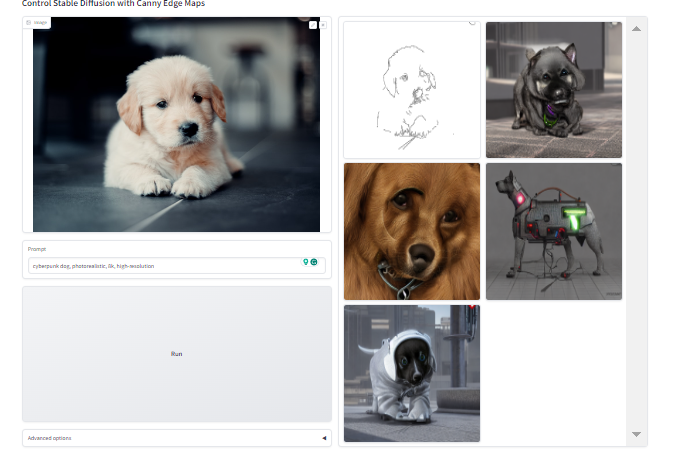
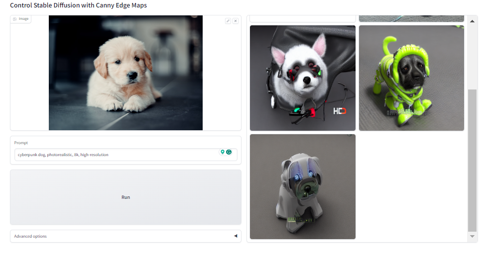
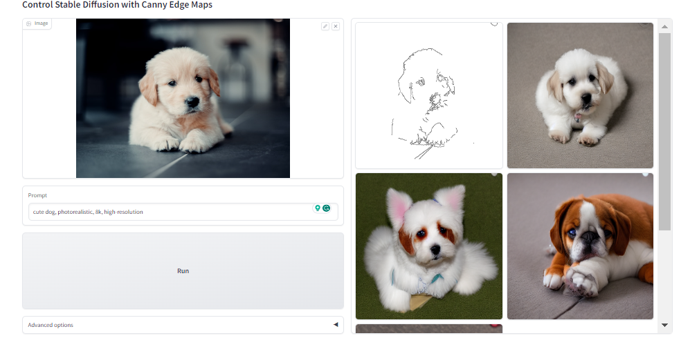
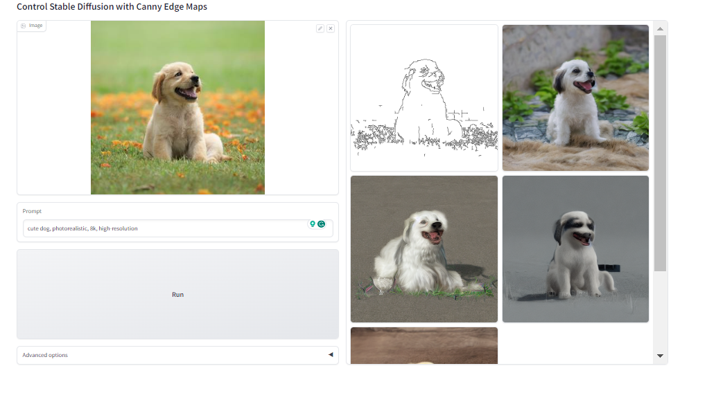

# CuteNet

A custom control-net trained specifically for generating dogs with extra conditions particulary canny edge map here.

## About Me

* ControlNet is a neural network architecture designed to control diffusion models by introducing additional conditions. It accomplishes this by duplicating the neural network blocks into both a "locked" copy and a "trainable" copy.

* The "trainable" copy is responsible for learning the specified conditions, while the "locked" copy preserves the original model. This ingenious approach allows training with small datasets of image pairs without compromising the production-ready diffusion models.

* The "zero convolution" is a 1×1 convolution with initialized weights and biases set to zeros. Prior to training, all zero convolutions produce zeros, ensuring that ControlNet doesn't introduce any distortions.

* What's remarkable is that no layer is trained from scratch; instead, the process involves fine-tuning the model. This safeguards your original model while enabling training on smaller or even personal devices.

* Moreover, this method is highly accommodating when it comes to merging, replacing, or offsetting models, weights, blocks, or layers.

* In this repository, you'll find a ControlNet model trained on a custom dog dataset, accessible through the provided Dataset Link. The training was performed using distributed training enabled through the PyTorch Lightning API on 2 A100 GPU clusters, running for one epoch over a duration of 4-5 hours. The results are promising, as the custom Control-Net specialized in dogs achieves excellent performance after being trained from scratch using the aforementioned custom dog dataset.

## How to run me?

### Minimum Requirements
* Atleast a V100 for a GPU, although an A100 (single/mutliple) with large vram would be preferable.
* Linux/Mac setup with python and conda

### Setup 
Initially, you would need to setup a conda enviroment with all the required packages. Go to the root directory of the project and set up and activate a conda environment as follows:

```
conda env create -f control-net.yaml
conda activate control

```

## Dataset Creation

Now for creating the dataset, we use the Stanford Dog Dataset as our base. It contains around 21k dog images. For all the preprocessing and dataset preparation we use the `CuteNetDSSetup.ipynb` file located at follwoing location in the root: `./ControlFIll/CuteNetDSSetup.ipynb`. Initially we need to clean up the dataset. We validate the images in the dataset by running the intial block (open_images() function) in the ipynb notebook. Further we run the resize images function to resize the images to 512x512. The later blocks create the source images by running the canny image detector to generate source canny images with the original colored images being target images. We generated captions for our all the images using the BLIP Captioning model (Requires GPU). The final blocks generate the required folder structure for training the Control Net model and restructure the prompts in a particular JSON'ish format.

## Training

* Follow the steps outlined in this document from the original ControlNet Model to train the model: [Training Instructions](https://github.com/lllyasviel/ControlNet/blob/main/docs/train.md). Also dont forget to change the dataset and model locations in the training and inference scripts. 
* Then run the `gradio_canny2image.py` to run the gradio demo. 

## Inference

* Download the model to the root of the project from [Trained Model](https://huggingface.co/gremlin97/CuteControlNet/tree/main). Also the whole preprocessed dataset directly from here [Dataset](https://huggingface.co/datasets/gremlin97/cute-controlnet). 
* Unzip it to the root and accordingly change the model and dataset locations in the inference and training scripts.
* Finally run `gradio_canny2image.py` to run the gradio demo. 

## Some sample outputs


*Prompt: cute dog*


*Prompt: cyberpunk dog*


*Prompt: cute dog*


*Prompt: cyberpunk dog*


*Prompt: cyberpunk dog*


*Prompt: cute dog*


*Prompt: cute dog*

### Contact
*Kunal Kasodekar*